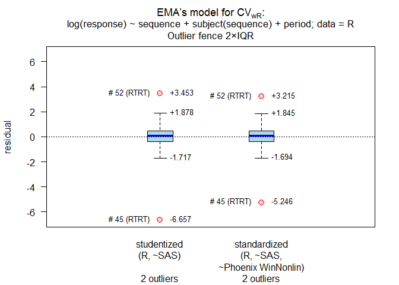

replicateBE
================

-   [Comparative BA-calculation for the EMA’s Average Bioequivalence
    with Expanding Limits
    (ABEL)](#user-content-comparative-ba-calculation-for-the-emas-average-bioequivalence-with-expanding-limits-abel)
-   [Introduction](#user-content-introduction)
    -   [Methods](#user-content-methods)
        -   [Estimation of *CV*wR (and *CV*wT in
            full replicate
            designs)](#user-content-estimation-of-cvwr-and-cvwt-in-full-replicate-designs)
        -   [Method A](#user-content-method-a)
        -   [Method B](#user-content-method-b)
        -   [Average Bioequivalence](#user-content-average-bioequivalence)
    -   [Tested designs](#user-content-tested-designs)
        -   [Four period (full)
            replicates](#user-content-four-period-full-replicates)
        -   [Three period (full)
            replicates](#user-content-three-period-full-replicates)
        -   [Two period (full) replicate](#user-content-two-period-full-replicate)
        -   [Three period (partial)
            replicates](#user-content-three-period-partial-replicates)
    -   [Cross-validation](#user-content-cross-validation)
-   [Examples](#user-content-examples)
-   [Installation](#user-content-installation)
-   [Disclaimer](#user-content-disclaimer)

<!-- README.md is generated from README.Rmd. Please edit that file
     Don't forget to change [#foo] to [#user-content-foo] in README.md -
     otherwise, the links in the TOC on GitHub will not work. -->

   

    # Version 1.5.0.9999 built 2020-10-12 with R 4.0.3 
    # (development version not on CRAN).

Comparative BA-calculation for the EMA’s Average Bioequivalence with Expanding Limits (ABEL)
--------------------------------------------------------------------------------------------

Introduction
------------

The library provides data sets (internal `.rda` and in
<abbr title="Character Separated Variables">CSV</abbr>-format in
`/extdata/`) which support users in a black-box performance
qualification (PQ) of their software installations. Users can perform
analysis of their own data imported from CSV- and Excel-files. The
methods given by the EMA in [Annex
I](https://www.ema.europa.eu/en/documents/other/31-annex-i-statistical-analysis-methods-compatible-ema-bioequivalence-guideline_en.pdf "EMA/582648/2016, 21 September 2016")
for reference-scaling according to the EMA’s [Guideline on the
Investigation of
Bioequivalence](https://www.ema.europa.eu/en/documents/scientific-guideline/guideline-investigation-bioequivalence-rev1_en.pdf "EMA, January 2010")
are implemented. Potential influence of outliers on the variability of
the reference can be assessed by box plots of studentized and
standardized residuals as suggested at a joint [EGA/EMA
workshop](https://www.medicinesforeurope.com/wp-content/uploads/2016/03/EGA_BEQ_QA_WEB_QA_1_32.pdf "London, June 2010").  
In full replicate designs the variability of test and reference
treatments can be assessed by *s*wT/*s*wR and the
upper confidence limit of *σ*wT/*σ*wR (required
for the [WHO’s
approach](https://extranet.who.int/prequal/sites/default/files/documents/AUC_criteria_November2018.pdf "Geneva, November 2018")
for reference-scaling of *AUC*).

<small>[TOC ↩](#user-content-replicatebe)</small>

### Methods

#### Estimation of *CV*wR (and *CV*wT in full replicate designs)

Called internally by functions `method.A()` and `method.B()`. A linear
model of log-transformed pharmacokinetic (PK) responses and effects  
    *sequence*, *subject(sequence)*, *period*  
where all effects are fixed (*i.e.*, ANOVA). Estimated by the function
`lm()` of library `stats`.

    modCVwR <- lm(log(PK) ~ sequence + subject%in%sequence + period,
                            data = data[data$treatment == "R", ])
    modCVwT <- lm(log(PK) ~ sequence + subject%in%sequence + period,
                            data = data[data$treatment == "T", ])

<small>[TOC ↩](#user-content-replicatebe)</small>

#### Method A

Called by function `method.A()`. A linear model of log-transformed PK
responses and effects  
    *sequence*, *subject(sequence)*, *period*, *treatment*  
where all effects are fixed (*i.e.*, ANOVA). Estimated by the function
`lm()` of library `stats`.

    modA <- lm(log(PK) ~ sequence + subject%in%sequence + period + treatment,
                         data = data)

<small>[TOC ↩](#user-content-replicatebe)</small>

#### Method B

Called by function `method.B()`. A linear model of log-transformed PK
responses and effects  
    *sequence*, *subject(sequence)*, *period*, *treatment*  
where *subject(sequence)* is a random effect and all others are fixed.  
Three options are provided

1.  Estimated by the function `lme()` of library `nlme`. Employs degrees
    of freedom equivalent to SAS’ `DDFM=CONTAIN`, Phoenix WinNonlin’s
    `Degrees of Freedom Residual`, STATISTICA’s `GLM containment`, and
    Stata’s `dfm=anova`. Implicitly preferred according to the EMA’s Q&A
    document and hence, the default of the function.

<!-- -->

    modB <- lme(log(PK) ~ sequence +  period + treatment, random = ~1|subject,
                          data = data)

1.  Estimated by the function `lmer()` of library `lmerTest`. Employs
    Satterthwaite’s approximation of the degrees of freedom
    `method.B(..., option = 1)` equivalent to SAS’ `DDFM=SATTERTHWAITE`,
    Phoenix WinNonlin’s `Degrees of Freedom Satterthwaite`, and Stata’s
    `dfm=Satterthwaite`. Note that this is the only available
    approximation in SPSS.

<!-- -->

    modB <- lmer(log(PK) ~ sequence + period + treatment + (1|subject),
                           data = data)

1.  Estimated by the function `lmer()` of library `lmerTest`. Employs
    the Kenward-Roger approximation `method.B(..., option = 3)`
    equivalent to Stata’s `dfm=Kenward Roger (EIM)` and SAS’
    `DDFM=KENWARDROGER(FIRSTORDER)` *i.e.*, based on the *expected*
    information matrix. Note that SAS with `DDFM=KENWARDROGER` and JMP
    calculate Sattertwaite’s (*sic*) degrees of freedom and apply the
    Kackar-Harville correction *i.e.*, based on the *observed*
    information matrix.

<!-- -->

    modB <- lmer(log(PK) ~ sequence + period + treatment + (1|subject),
                           data = data)

<small>[TOC ↩](#user-content-replicatebe)</small>

#### Average Bioequivalence

Called by function `ABE()`. The model is identical to
[Method A](#method-a). Conventional BE limits (80.00 – 125.00%) are
employed by default. Tighter limits (90.00 – 111.11%) for narrow
therapeutic index drugs (EMA) or wider limits (75.00 – 133.33%) for
*C*max according to the guidelines of the Gulf Cooperation
Council (Bahrain, Kuwait, Oman, Qatar, Saudi Arabia, United Arab
Emirates) and South Africa can be specified.

<small>[TOC ↩](#user-content-replicatebe)</small>

### Tested designs

#### Four period (full) replicates

`TRTR | RTRT`  
`TRRT | RTTR`  
`TTRR | RRTT`  
`TRTR | RTRT | TRRT | RTTR` <small>(confounded effects, *not
recommended*)</small>  
`TRRT | RTTR | TTRR | RRTT` <small>(confounded effects, *not
recommended*)</small>

#### Three period (full) replicates

`TRT | RTR`  
`TRR | RTT`

#### Two period (full) replicate

`TR | RT | TT | RR` <small>(Balaam’s design; *not recommended* due to
poor power characteristics)</small>

#### Three period (partial) replicates

`TRR | RTR | RRT`  
`TRR | RTR` <small>(Extra-reference design; biased in the presence of
period effects, *not recommended*)</small>

<small>[TOC ↩](#user-content-replicatebe)</small>

### Cross-validation

Details about the reference datasets:

    help("data", package = "replicateBE")
    ?replicateBE::data

Results of the 30 reference datasets agree with ones obtained in SAS
(9.4), Phoenix WinNonlin (6.4 – 8.1), STATISTICA (13), SPSS (22.0),
Stata (15.0), and JMP (10.0.2).

<small>[TOC ↩](#user-content-replicatebe)</small>

Examples
--------

-   Evaluation of the internal reference dataset 01 of [Annex
    II](https://www.ema.europa.eu/en/documents/other/31-annex-ii-statistical-analysis-bioequivalence-study-example-data-set_en.pdf "EMA, 21 September 2016")
    by Method A.

<!-- -->

    library(replicateBE) # attach the library
    res <- method.A(verbose = TRUE, details = TRUE, print = FALSE,
                    data = rds01)
    # 
    # Data set DS01: Method A by lm() 
    # ------------------------------- 
    # Analysis of Variance Table
    # 
    # Response: log(PK)
    #                   Df   Sum Sq  Mean Sq  F value     Pr(>F)
    # sequence           1   0.0077 0.007652  0.04783  0.8270958
    # period             3   0.6984 0.232784  1.45494  0.2278285
    # treatment          1   1.7681 1.768098 11.05095  0.0010405
    # sequence:subject  75 214.1296 2.855061 17.84467 < 2.22e-16
    # Residuals        217  34.7190 0.159995                    
    # 
    # treatment T – R:
    #   Estimate Std. Error    t value   Pr(>|t|) 
    # 0.14547400 0.04650870 3.12788000 0.00200215 
    # 217 Degrees of Freedom
    cols <- c(12, 15:19)           # extract relevant columns
    tmp  <- round(res[cols], 2)    # 2 decimal places acc. to the GL
    tmp  <- cbind(tmp, res[20:22]) # pass|fail
    print(tmp, row.names = FALSE)
    #  CVwR(%)  L(%)  U(%) CL.lo(%) CL.hi(%)  PE(%)   CI  GMR   BE
    #    46.96 71.23 140.4   107.11   124.89 115.66 pass pass pass

<small>[TOC ↩](#user-content-replicatebe)</small>

-   Same dataset evaluated by Method B, Kenward-Roger approximation of
    degrees of freedom. Outlier assessment, recalculation of
    *CV*wR after exclusion of outliers, new expanded limits.

<!-- -->

    res  <- method.B(option = 3, ola = TRUE, verbose = TRUE, details = TRUE,
                     print = FALSE, data = rds01)

<!-- -->

    # 
    # Outlier analysis
    #  (externally) studentized residuals
    #  Limits (2×IQR whiskers): -1.717435, 1.877877
    #  Outliers:
    #  subject sequence  stud.res
    #       45     RTRT -6.656940
    #       52     RTRT  3.453122
    # 
    #  standarized (internally studentized) residuals
    #  Limits (2×IQR whiskers): -1.69433, 1.845333
    #  Outliers:
    #  subject sequence stand.res
    #       45     RTRT -5.246293
    #       52     RTRT  3.214663
    # 
    # Data set DS01: Method B (option = 3) by lmer() 
    # ---------------------------------------------- 
    # Response: log(PK)
    # Type III Analysis of Variance Table with Kenward-Roger's method
    #             Sum Sq  Mean Sq NumDF    DenDF F value    Pr(>F)
    # sequence  0.001917 0.001917     1  74.9899 0.01198 0.9131528
    # period    0.398065 0.132688     3 217.3875 0.82878 0.4792976
    # treatment 1.579280 1.579280     1 217.2079 9.86432 0.0019197
    # 
    # treatment T – R:
    #   Estimate Std. Error    t value   Pr(>|t|) 
    #  0.1460900  0.0465140  3.1408000  0.0019197 
    # 217.208 Degrees of Freedom (equivalent to Stata’s dfm=Kenward Roger EIM)
    cols <- c(25, 28:29, 17:19)    # extract relevant columns
    tmp  <- round(res[cols], 2)    # 2 decimal places acc. to the GL
    tmp  <- cbind(tmp, res[30:32]) # pass|fail
    print(tmp, row.names = FALSE)
    #  CVwR.rec(%) L.rec(%) U.rec(%) CL.lo(%) CL.hi(%)  PE(%) CI.rec GMR.rec BE.rec
    #        32.16    78.79   126.93   107.17   124.97 115.73   pass    pass   pass

<small>[TOC ↩](#user-content-replicatebe)</small>

-   Evaluation of the internal reference dataset 05 of [Shumaker and
    Metzler](https://doi.org/10.1177/009286159803200426) by ABE, tighter
    limits for the narrow therapeutic index drug phenytoin.

<!-- -->

    res <- ABE(verbose = TRUE, theta1 = 0.90, details = TRUE,
               print = FALSE, data = rds05)
    # 
    # Data set DS05: ABE by lm() 
    # -------------------------- 
    # Analysis of Variance Table
    # 
    # Response: log(PK)
    #                  Df   Sum Sq   Mean Sq  F value     Pr(>F)
    # sequence          1 0.092438 0.0924383  6.81025  0.0109629
    # period            3 0.069183 0.0230609  1.69898  0.1746008
    # treatment         1 0.148552 0.1485523 10.94435  0.0014517
    # sequence:subject 24 2.526550 0.1052729  7.75581 4.0383e-12
    # Residuals        74 1.004433 0.0135734                    
    # 
    # treatment T – R:
    #   Estimate Std. Error    t value   Pr(>|t|) 
    # 0.07558800 0.02284850 3.30822000 0.00145167 
    # 74 Degrees of Freedom
    cols <- c(13:17)            # extract relevant columns
    tmp  <- round(res[cols], 2) # 2 decimal places acc. to the GL
    tmp  <- cbind(tmp, res[18]) # pass|fail
    print(tmp, row.names=FALSE)
    #  BE.lo(%) BE.hi(%) CL.lo(%) CL.hi(%)  PE(%)   BE
    #        90   111.11   103.82   112.04 107.85 fail

<small>[TOC ↩](#user-content-replicatebe)</small>

Installation
------------

The package requires R ≥3.5.0. However, for the Kenward-Roger
approximation `method.B(..., option = 3)` R ≥3.6.0 is required.

-   Install the released version from CRAN:

<!-- -->

    install.packages("replicateBE", repos = "https://cloud.r-project.org/")

-   To use the development version, please install the released version
    from [CRAN](https://cran.r-project.org/package=replicateBE) first to
    get its dependencies right
    ([readxl](https://cran.r-project.org/package=readxl) ≥1.0.0,
    [PowerTOST](https://cran.r-project.org/package=PowerTOST) ≥1.3.3,
    [lmerTest](https://cran.r-project.org/package=lmerTest),
    [nlme](https://cran.r-project.org/package=nlme),
    [pbkrtest](https://cran.r-project.org/package=pbkrtest)).

    You need tools for building R packages from sources on your machine.
    For Windows users:  

    -   Download
        [Rtools](https://cran.r-project.org/bin/windows/Rtools/) from
        CRAN and follow the suggestions of the installer.
    -   Install `devtools` and build the development version by:

<!-- -->

    install.packages("devtools", repos = "https://cloud.r-project.org/")
    devtools::install_github("Helmut01/replicateBE")

<small>[TOC ↩](#user-content-replicatebe)</small>

Disclaimer
----------

*Package offered for Use without any Guarantees and Absolutely No
Warranty. No Liability is accepted for any Loss and Risk to Public
Health Resulting from Use of this R-Code.*

<small>[TOC ↩](#user-content-replicatebe)</small>

------------------------------------------------------------------------
