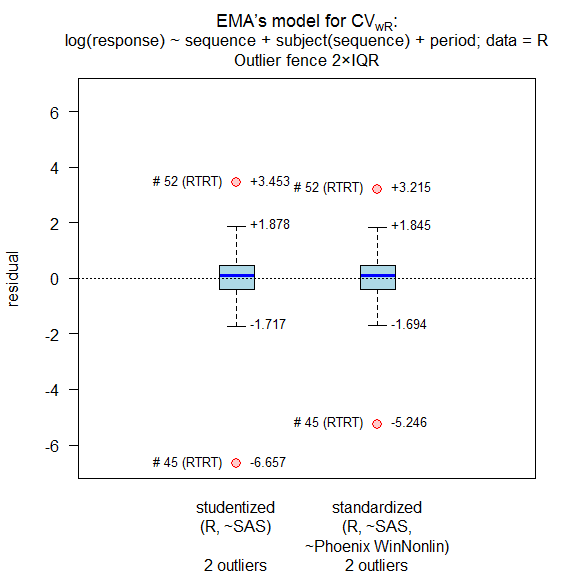

replicateBE
================

-   [Comparative BA-calculation for the EMA’s Average Bioequivalence
    with Expanding Limits
    (ABEL)](#comparative-ba-calculation-for-the-emas-average-bioequivalence-with-expanding-limits-abel)
-   [Introduction](#introduction)
    -   [Methods](#methods)
        -   [Estimation of *CV*wR (and *CV*wT in
            full replicate
            designs)](#estimation-of-cvwr-and-cvwt-in-full-replicate-designs)
        -   [Method A](#method-a)
        -   [Method B](#method-b)
        -   [Average Bioequivalence](#average-bioequivalence)
    -   [Tested designs](#tested-designs)
        -   [Four period (full)
            replicates](#four-period-full-replicates)
        -   [Three period (full)
            replicates](#three-period-full-replicates)
        -   [Two period (full) replicate](#two-period-full-replicate)
        -   [Three period (partial)
            replicates](#three-period-partial-replicates)
    -   [Cross-validation](#cross-validation)
-   [Examples](#examples)
-   [Installation](#installation)
-   [Session Information](#session-information)
-   [Disclaimer](#disclaimer)

<!-- README.md is generated from README.Rmd. Please edit that file
     Don't forget to change [#foo] to [#foo] in README.md -
     otherwise, the links in the TOC on GitHub will not work. -->

   

Version 1.1.9000 built 2021-05-17 with R 4.0.5 (development version not
on CRAN).

## Comparative BA-calculation for the EMA’s Average Bioequivalence with Expanding Limits (ABEL)

## Introduction

The library provides data sets (internal `.rda` and in CSV-format in `/extdata/`)
which support users in a black-box performance qualification (PQ) of
their software installations. Users can perform analysis of their own
data imported from CSV- and Excel-files. The
methods given by the EMA[1](#f1)
for reference-scaling according to the EMA’s Guideline on the
Investigation of Bioequivalence[2](#f2) are
implemented. Potential influence of outliers on the variability of the
reference can be assessed by box plots of studentized and standardized
residuals as suggested at a joint EGA/EMA
workshop.[3](#f3)  
Direct widening of the acceptance range as recommended by the Gulf
Cooperation Council[4](#f4) (Bahrain, Kuwait, Oman,
Qatar, Saudi Arabia, United Arab Emirates) is provided as well.  
In full replicate designs the variability of test and reference
treatments can be assessed by *s*wT/*s*wR and the
upper confidence limit of *σ*wT/*σ*wR (required
for the WHO’s
approach[5](#f5) for reference-scaling of *AUC*).

<small>[TOC ↩](#replicatebe)</small>

### Methods

#### Estimation of *CV*wR (and *CV*wT in full replicate designs)

Called internally by functions `method.A()` and `method.B()`. A linear
model of log-transformed pharmacokinetic (PK) responses and effects  
    *sequence*, *subject*(*sequence*), *period*  
where all effects are fixed (*i.e.*, ANOVA). Estimated by the function
`lm()` of library `stats`.

    modCVwR <- lm(log(PK) ~ sequence + subject%in%sequence + period,
                            data = data[data$treatment == "R", ])
    modCVwT <- lm(log(PK) ~ sequence + subject%in%sequence + period,
                            data = data[data$treatment == "T", ])

<small>[TOC ↩](#replicatebe)</small>

#### Method A

Called by function `method.A()`. A linear model of log-transformed PK responses and effects  
    *sequence*, *subject*(*sequence*), *period*, *treatment*  
where all effects are fixed (*i.e.*, ANOVA). Estimated by the function
`lm()` of library `stats`.

    modA <- lm(log(PK) ~ sequence + subject%in%sequence + period + treatment,
                         data = data)

<small>[TOC ↩](#replicatebe)</small>

#### Method B

Called by function `method.B()`. A linear model of log-transformed PK responses and effects  
    *sequence*, *subject*(*sequence*), *period*, *treatment*  
where *subject*(*sequence*) is a random effect and all others are
fixed.  
Three options are provided:

-   Estimated by the function `lmer()` of library `lmerTest`.
    `method.B(..., option = 1)` employs Satterthwaite’s approximation of
    the degrees of freedom equivalent to SAS’ `DDFM=SATTERTHWAITE`,
    Phoenix WinNonlin’s `Degrees of Freedom Satterthwaite`, and Stata’s
    `dfm=Satterthwaite`. Note that this is the only available
    approximation in SPSS.

<!-- -->

    modB <- lmer(log(PK) ~ sequence + period + treatment + (1|subject),
                           data = data)

-   Estimated by the function `lme()` of library `nlme`.
    `method.B(..., option = 2)` employs degrees of freedom equivalent to
    SAS’ `DDFM=CONTAIN`, Phoenix WinNonlin’s
    `Degrees of Freedom Residual`, STATISTICA’s `GLM containment`, and
    Stata’s `dfm=anova`. Implicitly preferred according to the EMA’s Q&A document and hence, the
    default of the function.

<!-- -->

    modB <- lme(log(PK) ~ sequence +  period + treatment, random = ~1|subject,
                          data = data)

-   Estimated by the function `lmer()` of library `lmerTest`.
    `method.B(..., option = 3)` employs the Kenward-Roger approximation
    equivalent to Stata’s `dfm=Kenward Roger (EIM)` and SAS’
    `DDFM=KENWARDROGER(FIRSTORDER)` *i.e.*, based on the *expected*
    information matrix. Note that SAS with `DDFM=KENWARDROGER` and JMP
    calculate Satterthwaite’s (*sic*) degrees of freedom and apply the
    Kackar-Harville correction *i.e.*, based on the *observed*
    information matrix.

<!-- -->

    modB <- lmer(log(PK) ~ sequence + period + treatment + (1|subject),
                           data = data)

<small>[TOC ↩](#replicatebe)</small>

#### Average Bioequivalence

Called by function `ABE()`. The model is identical to
[Method A](#method-a). Conventional BE limits (80.00 – 125.00%) are
employed by default. Tighter limits (90.00 – 111.11%) for narrow
therapeutic index drugs (EMA and others) or wider limits
(75.00 – 133.33%) for *C*max according to the guideline of
South Africa can be specified.

<small>[TOC ↩](#replicatebe)</small>

### Tested designs

#### Four period (full) replicates

`TRTR | RTRT`  
`TRRT | RTTR`  
`TTRR | RRTT`  
`TRTR | RTRT | TRRT | RTTR`  
`TRRT | RTTR | TTRR | RRTT`

#### Three period (full) replicates

`TRT | RTR`  
`TRR | RTT`

#### Two period (full) replicate

`TR | RT | TT | RR` <small>(Balaam’s design; *not recommended* due to
poor power characteristics)</small>

#### Three period (partial) replicates

`TRR | RTR | RRT`  
`TRR | RTR` <small>(Extra-reference design; biased in the presence of
period effects, *not recommended*)</small>

<small>[TOC ↩](#replicatebe)</small>

### Cross-validation

Details about the reference datasets:

    help("data", package = "replicateBE")
    ?replicateBE::data

Results of the 30 reference datasets agree[6](#f6)
with ones obtained in SAS (9.4), Phoenix WinNonlin (6.4 – 8.1),
STATISTICA (13), SPSS (22.0), Stata (15.0), and JMP (10.0.2).

<small>[TOC ↩](#replicatebe)</small>

## Examples

-   Evaluation of the internal reference dataset 01 of Annex
    II[7](#f7) by Method A.

<!-- -->

    library(replicateBE) # attach the library
    res <- method.A(verbose = TRUE, details = TRUE, print = FALSE,
                    data = rds01)
    # 
    # Data set DS01: Method A by lm() 
    # ----------------------------------- 
    # Type III Analysis of Variance Table
    # 
    # Response: log(PK)
    #                   Df   Sum Sq  Mean Sq  F value     Pr(>F)
    # sequence           1   0.0077 0.007652  0.00268  0.9588496
    # period             3   0.6984 0.232784  1.45494  0.2278285
    # treatment          1   1.7681 1.768098 11.05095  0.0010405
    # sequence:subject  75 214.1296 2.855061 17.84467 < 2.22e-16
    # Residuals        217  34.7190 0.159995                    
    # 
    # treatment T – R:
    #   Estimate Std. Error    t value   Pr(>|t|) 
    # 0.14547400 0.04650870 3.12788000 0.00200215 
    # 217 Degrees of Freedom
    cols <- c(12, 17:21)           # extract relevant columns
    # cosmetics: 2 decimal places acc. to the GL
    tmp  <- data.frame(as.list(sprintf("%.2f", res[cols])))
    names(tmp) <- names(res)[cols]
    tmp  <- cbind(tmp, res[22:24]) # pass|fail
    print(tmp, row.names = FALSE)
    #  CVwR(%)  L(%)   U(%) CL.lo(%) CL.hi(%)  PE(%)   CI  GMR   BE
    #    46.96 71.23 140.40   107.11   124.89 115.66 pass pass pass

<small>[TOC ↩](#replicatebe)</small>

-   Same dataset evaluated according to the conditions of the GCC.

<!-- -->

    res <- method.A(regulator = "GCC", details = TRUE, print = FALSE,
                    data = rds01)
    cols <- c(12, 17:21)
    tmp  <- data.frame(as.list(sprintf("%.2f", res[cols])))
    names(tmp) <- names(res)[cols]
    tmp  <- cbind(tmp, res[22:24])
    print(tmp, row.names = FALSE)
    #  CVwR(%)  L(%)   U(%) CL.lo(%) CL.hi(%)  PE(%)   CI  GMR   BE
    #    46.96 75.00 133.33   107.11   124.89 115.66 pass pass pass

<small>[TOC ↩](#replicatebe)</small>

-   Same dataset evaluated by Method B, Kenward-Roger approximation of
    degrees of freedom. Outlier assessment, recalculation of
    *CV*wR after exclusion of outliers, new expanded limits.

<!-- -->

    res  <- method.B(option = 3, ola = TRUE, verbose = TRUE,
                     details = TRUE, print = FALSE, data = rds01)

<!-- -->

    # 
    # Outlier analysis
    #  (externally) studentized residuals
    #  Limits (2×IQR whiskers): -1.717435, 1.877877
    #  Outliers:
    #  subject sequence  stud.res
    #       45     RTRT -6.656940
    #       52     RTRT  3.453122
    # 
    #  standarized (internally studentized) residuals
    #  Limits (2×IQR whiskers): -1.69433, 1.845333
    #  Outliers:
    #  subject sequence stand.res
    #       45     RTRT -5.246293
    #       52     RTRT  3.214663
    # 
    # Data set DS01: Method B (option = 3) by lmer() 
    # ---------------------------------------------- 
    # Response: log(PK)
    # Type III Analysis of Variance Table with Kenward-Roger's method
    #             Sum Sq  Mean Sq NumDF    DenDF F value    Pr(>F)
    # sequence  0.001917 0.001917     1  74.9899 0.01198 0.9131528
    # period    0.398065 0.132688     3 217.3875 0.82878 0.4792976
    # treatment 1.579280 1.579280     1 217.2079 9.86432 0.0019197
    # 
    # treatment T – R:
    #   Estimate Std. Error    t value   Pr(>|t|) 
    #  0.1460900  0.0465140  3.1408000  0.0019197 
    # 217.208 Degrees of Freedom (equivalent to Stata’s dfm=Kenward Roger EIM)
    cols <- c(27, 31:32, 19:21)
    tmp  <- data.frame(as.list(sprintf("%.2f", res[cols])))
    names(tmp) <- names(res)[cols]
    tmp  <- cbind(tmp, res[22:24])
    print(tmp, row.names = FALSE)
    #  CVwR.rec(%) L.rec(%) U.rec(%) CL.lo(%) CL.hi(%)  PE(%)   CI  GMR   BE
    #        32.16    78.79   126.93   107.17   124.97 115.73 pass pass pass

<small>[TOC ↩](#replicatebe)</small>

-   Evaluation of the internal reference dataset 05 of Shumaker and
    Metzler,[8](#f8) tighter limits for the narrow
    therapeutic index drug phenytoin.

<!-- -->

    res <- ABE(verbose = TRUE, theta1 = 0.90, details = TRUE,
               print = FALSE, data = rds05)
    # 
    # Data set DS05: ABE by lm() 
    # ----------------------------------- 
    # Type III Analysis of Variance Table
    # 
    # Response: log(PK)
    #                  Df   Sum Sq   Mean Sq  F value     Pr(>F)
    # sequence          1 0.092438 0.0924383  0.87808  0.3580620
    # period            3 0.069183 0.0230609  1.69898  0.1746008
    # treatment         1 0.148552 0.1485523 10.94435  0.0014517
    # sequence:subject 24 2.526550 0.1052729  7.75581 4.0383e-12
    # Residuals        74 1.004433 0.0135734                    
    # 
    # treatment T – R:
    #   Estimate Std. Error    t value   Pr(>|t|) 
    # 0.07558800 0.02284850 3.30822000 0.00145167 
    # 74 Degrees of Freedom
    cols <- c(13:17)
    tmp  <- data.frame(as.list(sprintf("%.2f", res[cols])))
    names(tmp) <- names(res)[cols]
    tmp  <- cbind(tmp, res[18])
    print(tmp, row.names = FALSE)
    #  BE.lo(%) BE.hi(%) CL.lo(%) CL.hi(%)  PE(%)   BE
    #     90.00   111.11   103.82   112.04 107.85 fail

<small>[TOC ↩](#replicatebe)</small>

## Installation

The package requires R ≥3.5.0. However, for the Kenward-Roger
approximation `method.B(..., option = 3)` R ≥3.6.0 is required.

-   Install the released version from CRAN:

<!-- -->

    install.packages("replicateBE", repos = "https://cloud.r-project.org/")

-   To use the development version, please install the released version
    from [CRAN](https://cran.r-project.org/package=replicateBE) first to
    get its dependencies right
    ([readxl](https://cran.r-project.org/package=readxl) ≥1.0.0,
    [PowerTOST](https://cran.r-project.org/package=PowerTOST) ≥1.5.3,
    [lmerTest](https://cran.r-project.org/package=lmerTest),
    [nlme](https://cran.r-project.org/package=nlme),
    [pbkrtest](https://cran.r-project.org/package=pbkrtest)).

    You need tools for building R packages from sources on your machine.
    For Windows users:  

    -   Download
        [Rtools](https://cran.r-project.org/bin/windows/Rtools/) from
        CRAN
        and follow the suggestions of the installer.
    -   Install `devtools` and build the development version by:

<!-- -->

    install.packages("devtools", repos = "https://cloud.r-project.org/")
    devtools::install_github("Helmut01/replicateBE")

<small>[TOC ↩](#replicatebe)</small>

## Session Information

Inspect this information for reproducibility. Of particular importance
are the versions of R and the packages used to create this workflow. It
is considered good practice to record this information with every
analysis.  
Version 1.1.9000 built 2021-05-17 with R 4.0.5.

    options(width = 60)
    devtools::session_info()
    # - Session info -------------------------------------------
    #  setting  value                       
    #  version  R version 4.0.5 (2021-03-31)
    #  os       Windows 7 x64 SP 1          
    #  system   x86_64, mingw32             
    #  ui       RTerm                       
    #  language EN                          
    #  collate  German_Germany.1252         
    #  ctype    German_Germany.1252         
    #  tz       Europe/Vienna               
    #  date     2021-05-17                  
    # 
    # - Packages -----------------------------------------------
    #  package       * version    date       lib source        
    #  backports       1.2.1      2020-12-09 [1] CRAN (R 4.0.3)
    #  boot            1.3-28     2021-05-03 [1] CRAN (R 4.0.5)
    #  broom           0.7.6      2021-04-05 [1] CRAN (R 4.0.5)
    #  cachem          1.0.4      2021-02-13 [1] CRAN (R 4.0.4)
    #  callr           3.7.0      2021-04-20 [1] CRAN (R 4.0.5)
    #  cellranger      1.1.0      2016-07-27 [1] CRAN (R 4.0.0)
    #  cli             2.5.0      2021-04-26 [1] CRAN (R 4.0.5)
    #  colorspace      2.0-1      2021-05-04 [1] CRAN (R 4.0.5)
    #  crayon          1.4.1      2021-02-08 [1] CRAN (R 4.0.3)
    #  cubature        2.0.4.2    2021-05-13 [1] CRAN (R 4.0.5)
    #  desc            1.3.0      2021-03-05 [1] CRAN (R 4.0.4)
    #  devtools        2.4.1      2021-05-05 [1] CRAN (R 4.0.5)
    #  digest          0.6.27     2020-10-24 [1] CRAN (R 4.0.3)
    #  dplyr           1.0.6      2021-05-05 [1] CRAN (R 4.0.5)
    #  ellipsis        0.3.2      2021-04-29 [1] CRAN (R 4.0.5)
    #  evaluate        0.14       2019-05-28 [1] CRAN (R 4.0.0)
    #  fansi           0.4.2      2021-01-15 [1] CRAN (R 4.0.3)
    #  fastmap         1.1.0      2021-01-25 [1] CRAN (R 4.0.3)
    #  fs              1.5.0      2020-07-31 [1] CRAN (R 4.0.2)
    #  generics        0.1.0      2020-10-31 [1] CRAN (R 4.0.3)
    #  ggplot2         3.3.3      2020-12-30 [1] CRAN (R 4.0.5)
    #  glue            1.4.2      2020-08-27 [1] CRAN (R 4.0.2)
    #  gtable          0.3.0      2019-03-25 [1] CRAN (R 4.0.0)
    #  highr           0.9        2021-04-16 [1] CRAN (R 4.0.5)
    #  htmltools       0.5.1.1    2021-01-22 [1] CRAN (R 4.0.3)
    #  knitr           1.33       2021-04-24 [1] CRAN (R 4.0.5)
    #  lattice         0.20-44    2021-05-02 [1] CRAN (R 4.0.5)
    #  lifecycle       1.0.0      2021-02-15 [1] CRAN (R 4.0.4)
    #  lme4            1.1-26     2020-12-01 [1] CRAN (R 4.0.3)
    #  lmerTest        3.1-3      2020-10-23 [1] CRAN (R 4.0.3)
    #  magrittr        2.0.1      2020-11-17 [1] CRAN (R 4.0.3)
    #  MASS            7.3-54     2021-05-03 [1] CRAN (R 4.0.5)
    #  Matrix          1.2-18     2019-11-27 [1] CRAN (R 4.0.3)
    #  memoise         2.0.0      2021-01-26 [1] CRAN (R 4.0.3)
    #  minqa           1.2.4      2014-10-09 [1] CRAN (R 4.0.0)
    #  munsell         0.5.0      2018-06-12 [1] CRAN (R 4.0.0)
    #  mvtnorm         1.1-1      2020-06-09 [1] CRAN (R 4.0.0)
    #  nlme            3.1-152    2021-02-04 [1] CRAN (R 4.0.5)
    #  nloptr          1.2.2.2    2020-07-02 [1] CRAN (R 4.0.2)
    #  numDeriv        2016.8-1.1 2019-06-06 [1] CRAN (R 4.0.0)
    #  pbkrtest        0.5.1      2021-03-09 [1] CRAN (R 4.0.4)
    #  pillar          1.6.1      2021-05-16 [1] CRAN (R 4.0.5)
    #  pkgbuild        1.2.0      2020-12-15 [1] CRAN (R 4.0.3)
    #  pkgconfig       2.0.3      2019-09-22 [1] CRAN (R 4.0.0)
    #  pkgload         1.2.1      2021-04-06 [1] CRAN (R 4.0.5)
    #  PowerTOST       1.5.3.9000 2021-05-09 [1] local         
    #  prettyunits     1.1.1      2020-01-24 [1] CRAN (R 4.0.0)
    #  processx        3.5.2      2021-04-30 [1] CRAN (R 4.0.5)
    #  ps              1.6.0      2021-02-28 [1] CRAN (R 4.0.4)
    #  purrr           0.3.4      2020-04-17 [1] CRAN (R 4.0.0)
    #  R6              2.5.0      2020-10-28 [1] CRAN (R 4.0.3)
    #  Rcpp            1.0.6      2021-01-15 [1] CRAN (R 4.0.3)
    #  readxl          1.3.1      2019-03-13 [1] CRAN (R 4.0.0)
    #  remotes         2.3.0      2021-04-01 [1] CRAN (R 4.0.5)
    #  replicateBE   * 1.1.9000   2021-05-17 [1] local         
    #  rlang           0.4.11     2021-04-30 [1] CRAN (R 4.0.5)
    #  rmarkdown       2.8        2021-05-07 [1] CRAN (R 4.0.5)
    #  rprojroot       2.0.2      2020-11-15 [1] CRAN (R 4.0.3)
    #  scales          1.1.1      2020-05-11 [1] CRAN (R 4.0.0)
    #  sessioninfo     1.1.1      2018-11-05 [1] CRAN (R 4.0.0)
    #  statmod         1.4.36     2021-05-10 [1] CRAN (R 4.0.5)
    #  stringi         1.5.3      2020-09-09 [1] CRAN (R 4.0.2)
    #  stringr         1.4.0      2019-02-10 [1] CRAN (R 4.0.0)
    #  TeachingDemos   2.12       2020-04-07 [1] CRAN (R 4.0.0)
    #  testthat        3.0.2      2021-02-14 [1] CRAN (R 4.0.4)
    #  tibble          3.1.1      2021-04-18 [1] CRAN (R 4.0.5)
    #  tidyr           1.1.3      2021-03-03 [1] CRAN (R 4.0.4)
    #  tidyselect      1.1.1      2021-04-30 [1] CRAN (R 4.0.5)
    #  usethis         2.0.1      2021-02-10 [1] CRAN (R 4.0.3)
    #  utf8            1.2.1      2021-03-12 [1] CRAN (R 4.0.4)
    #  vctrs           0.3.8      2021-04-29 [1] CRAN (R 4.0.5)
    #  withr           2.4.2      2021-04-18 [1] CRAN (R 4.0.5)
    #  xfun            0.22       2021-03-11 [1] CRAN (R 4.0.4)
    #  yaml            2.2.1      2020-02-01 [1] CRAN (R 4.0.0)
    # 
    # [1] D:/Program Files/R/R-4.0.5/library

<small>[TOC ↩](#replicatebe)</small>

## Disclaimer

*Package offered for Use without any Guarantees and Absolutely No
Warranty. No Liability is accepted for any Loss and Risk to Public
Health Resulting from Use of this R-Code.*

<small>[TOC ↩](#replicatebe)</small>

------------------------------------------------------------------------

1. [EMA/582648/2016. Annex
I.](https://www.ema.europa.eu/en/documents/other/31-annex-i-statistical-analysis-methods-compatible-ema-bioequivalence-guideline_en.pdf)
21 September 2016. [↩](#a1)  
2. [CPMP/EWP/QWP/1401/98 Rev. 1/
Corr
\*\*.](https://www.ema.europa.eu/en/documents/scientific-guideline/guideline-investigation-bioequivalence-rev1_en.pdf)
20 January 2010. [↩](#a2)  
3. [Revised EMA Bioequivalence
Guideline. Questions &
Answers.](https://www.medicinesforeurope.com/wp-content/uploads/2016/03/EGA_BEQ_QA_WEB_QA_1_32.pdf)
London, June 2010. [↩](#a3)  
4. [The GCC Guidelines for
Bioequivalence. Version
2.4.](https://old.sfda.gov.sa/en/drug/drug_reg/Regulations/GCC_Guidelines_Bioequivalence.pdf)
30/3/2016. [↩](#a4)  
5. [Application of
reference-scaled criteria for AUC in bioequivalence studies conducted
for submission to
PQTm.](https://extranet.who.int/pqweb/sites/default/files/documents/AUC_criteria_November2018.pdf)
22 November 2018. [↩](#a5)  
6. Schütz H, Tomashevskiy M,
Labes D, Shitova A, González-de la Parra M, Fuglsang A. *Reference
Datasets for Studies in a Replicate Design Intended for Average
Bioequivalence with Expanding Limits.* AAPS J. 2020; 22(2): Article 44.
[doi:10.1208/s12248-020-0427-6](https://doi.org/10.1208/s12248-020-0427-6).
[↩](#a6)  
7. [EMA/582648/2016. Annex
II.](https://www.ema.europa.eu/en/documents/other/31-annex-ii-statistical-analysis-bioequivalence-study-example-data-set_en.pdf)
21 September 2016. [↩](#a7)  
8. Shumaker RC, Metzler CM. *The
Phenytoin Trial is a Case Study of ‘Individual’ Bioequivalence.* Drug
Inf J. 1998; 32(4): 1063–1072.
[doi:10.1177/009286159803200426](https://doi.org/10.1177/009286159803200426).
[↩](#a8)
