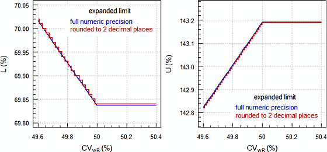

```{r, include = FALSE}
knitr::opts_chunk$set(
  collapse = TRUE,
  comment = "#>"
)
```

```{r setup}
library(replicateBE)
```

* [Disclaimer](#disclaimer)
* [Introduction](#intro)
* [Methods](#methods)
    * [Method A](#methodA)
    * [Method B](#methodB)
    * [ABE](#ABE)
* [Tested designs](#designs)
    * [Four period (full) replicates](#per4_full)
    * [Three period (full) replicates](#per3_full)
    * [Two period (full) replicate](#per2_full)
    * [Three period (partial) replicates](#per3_part)
* [Data structure](#data_struct)
    * [Incomplete data](#incomplete)
      * [Estimation of _CV~w~_](#setCW)
      * [Assessment of BE](#setBE)
      * [Example of different data sets](#setexpl)

* [Notes on the methods](#notes)
    * [Estimation of intra-subject variability](#cv)
    * [Model structure](#model_struc)
    * [BE limits, PE restriction, rounding issues](#BElim)
    * [Degrees of freedom, comparison of methods](#df_comp)
    * [Outlier analysis](#ola)
* [Applicability, outlook](#app_out)
* [Cross-validation](#cross)
* [Contributors](#contr)
* [Session Information](#session)

---
### Disclaimer{#disclaimer}
**Program offered for Use without any Guarantees and Absolutely No Warranty. No Liability is accepted for any Loss and Risk to Public Health Resulting from Use of this R-Code.**

### Introduction{#intro}
The library provides data sets (internal `.rda` and in CSV-format in `/extdata/`) given by Schütz _et al_.^[Schütz H, Tomashevskiy M, Labes D, Shitova A, González-de la Parra M, Fuglsang A. _Reference Data­sets for Studies in a Replicate Design intended for Average Bioequivalence with Expanding Limits._ Manu­script in pre­paration 2019.] which support users in a black-box performance qualification (PQ) of their software installations.


The methods given by the EMA in [Annex I](https://www.ema.europa.eu/en/documents/other/31-annex-i-statistical-analysis-methods-compatible-ema-bioequivalence-guideline_en.pdf "EMA/582648/2016, 21 September 2016") for reference-scaling according to the EMA’s [Guideline on the Investigation of Bioequivalence](https://www.ema.europa.eu/en/documents/scientific-guideline/guideline-investigation-bioequivalence-rev1_en.pdf "EMA, January 2010") are implemented. Potential influence of outliers on the variability of the reference can be assessed by box plots of studentized and standardized residuals as suggested at a joint [EGA/EMA workshop](https://www.medicinesforeurope.com/wp-content/uploads/2016/03/EGA_BEQ_QA_WEB_QA_1_32.pdf "London, June 2010").

### Methods{#methods}
#### function `method.A()`{#methodA}
A linear model of log-transformed PK responses and effects\
    _sequence_, _subject(sequence)_, _period_, _treatment_\
where all effects are fixed (_i.e._, ANOVA). Estimated via function `lm()` of library `stats`.

```{r eval=FALSE}
modA <- lm(log(PK) ~ sequence + subject%in%sequence + period + treatment,
                     data = data)
```

#### function `method.B()`{#methodB}
A linear model of log-transformed PK responses and effects\
    _sequence_, _subject(sequence)_, _period_, _treatment_\
where _subject(sequence)_ is a random effect and all others are fixed.  
Two options are provided

1.  Estimated via function `lmer()` of library `lmerTest`. Uses Satterthwaite’s degrees of freedom.\
`method.B(..., option = 1)`
```{r eval=FALSE}
modB <- lmer(log(PK) ~ sequence + period + treatment + (1|subject),
                       data = data)
```

2.  Estimated via function `lme()` of library `nlme`. Uses degrees of freedom equivalent to SAS’ `DDFM=CONTAIN` and Phoenix WinNonlin’s `DF Residual`. Implicitly preferred according to the Q&A document.\
`method.B(..., option = 2)`, the default.\
```{r eval=FALSE}
modB <- lme(log(PK) ~ sequence +  period + treatment, random = ~1|subject,
                     data = data)
```


#### function `ABE()`{#ABE}
Conventional Average Bioequivalence, where the model is identical to [Method A](#methodA). Tighter limits for narrow therapeutic index drugs (EMA 90.00 – 111.11%) or wider limits (75.00 – 133.33% for C~max~ according to the guideline of the GCC^[Gulf Cooperation Council: Bahrain, Kuwait, Oman, Qatar, Saudi Arabia, and the United Arab Emirates.]) can be specified.


### Tested designs{#designs}
Details about the reference data sets:
```{r eval=FALSE}
help("data", package = "replicateBE")
?replicateBE::data
```
#### Four period (full) replicates{#per4_full}
Both the test and the reference treatments are administered at least once.

`TRTR | RTRT`  
`TRRT | RTTR`  
`TTRR | RRTT`  
`TRTR | RTRT | TRRT | RTTR` ^[Confounded effects (design _not recommended_).]  
`TRRT | RTTR | TTRR | RRTT` ^[Confounded effects (design _not recommended_).]

#### Three period (full) replicates{#per3_full}
The test treatment is administered at least once to ½ of the subjects and the reference treatment at least once to the respective other ½ of the subjects.

`TRT | RTR`  
`TRR | RTT`

#### Two period (full) replicate{#per2_full}
The test and reference treatments are administered once to ½ of the subjects (for the estimation of the CI). _I.e._, the first group of subjects follow a conventional 2×2×2 trial. In the second group the test and reference treatments are administered at least once to ¼ of the subjects, repectively (for the estimation of _CV~wT~_ and _CV~wR~_).

`TR | RT | TT | RR` ^[Balaam’s design (_not recommended_ due to its poor power characteristics).]

#### Three period (partial) replicates{#per3_part}
The test treatment is administered once and the reference treatment at least once.

`TRR | RTR | RRT`  
`TRR | RTR` ^[Extra-reference design; biased in the presence of period effects (design _not recommended_).]


### Data structure{#data_struct}
Columns must have the headers `subject`, `period`, `sequence`, `treatment`, `PK`, and/or `logPK`.^[Napierian logarithm (base _e_). The decadic logarithm (base 10) is not supported).] Any order of columns is acceptable. Uppercase and mixed case headers will be internally converted to lowercase headers.

| variable | format |
|-|----------|
| `subject` | Integer numbers or any combination of alphanumerics (A-Z, a-z, -, _, #, 0-9) |
| `period` | Integer numbers |
| `sequence` | Numbers or any other literal sequences not listed in the [tested designs](#designs) are not accepted (_e.g._, `ABAB`). |
| `treatment` | The Test treatment must be coded `T` and the Reference `R` (both uppercase). |

Relevant data are used for the estimation of _CV~wR~_ (and _CV~wT~_ in full replicate designs) and BE, _i.e._, the data sets might be different (see the [example](#setexpl)). It is good practice to state that in the Statistical Analysis Plan (SAP).

#### Incomplete data{#incomplete}
##### Estimation of _CV~w~_{#setCW}
If a subject drops out from the study in a higher period, data of repeated administrations will still be used for the estimation of _CV~w~_, although data of the other treatment might be missing. Examples for the estimation of _CV~wR~_ (missings denoted by `.`):\
`RTRT` → `RTR.`\
`TRRT` → `TRR.`\
`RRTT` → `RRT.` or `RR..`\
`RRT` → `RR..`\


##### Assessment of BE{#setBE}
If a subject drops out from the study in a higher period, data with at least one administration of the Test and Reference will be used in the assessment of BE. Examples (missings denoted by `.`):\

`TRTR` → `TRT.` or → `TR..`\
`RTRT` → `RTR.` or → `RT..`\
`TRRT` → `TRR.` or → `TR..`\
`RTTR` → `RTT.` or → `RT..`\
`TTRR` → `TTR.`\
`TRT` → `TR.`\
`RTR` → `RT.`\
`TRR` → `TR.`\
`RTR` → `RT.`\
`RTT` → `RT.`\


##### Example of different data sets{#setexpl}
16 subjects enrolled in the study. In sequence `RTRT` one dropout in the 2^nd^ period and one in the 4^th^ period. In sequence `TRTR` one dropout in the 3^rd^ period and one in the 4^th^.\

`1  RTR.    5  RTRT    9  TRTR   13  RTRT`\
`2  RTRT    6  TR..   10  TRTR   14  TRT.`\
`3  RTRT    7  RTRT   11  RTRT   15  TRTR`\
`4  TRTR    8  R...   12  TRTR   16  TRTR`  

We obtain these data sets:

| purpose | included subjects | excluded |
|-----|----------|---|
| Estimation of _CV~wR~_ | 13 who received 2 treatments `R` | 6, 8, 14 |
| Estimation of _CV~wT~_ | 12 who received 2 treatments `T` | 1, 6, 8 |
| Assessment of BE | 15 who received ≥1 treatment `T` _and_ `R` | 8 |


### Notes on the methods{#notes}
#### Estimation of intra-subject variability{#cv}
The EMA proposed a linear model of log-transformed PK responses of the reference treatment\
    _sequence_, _subject(sequence)_, _period_\
where all effects are fixed. Estimated via function `lm()` of library `stats`:
```{r eval=FALSE}
modCV <- lm(log(PK) ~ sequence + subject%in%sequence + period,
                      data = data[data$treatment = "R", ])
```
For informational purposes in full replicate designs (required by the WHO for reference-scaling of AUC) the same model is run with `data = data[data$treatment = "T", ]`.

Special conditions for the sample size in three period full replicate designs:

> _The question raised asks if it is possible to use a design where subjects are randomised to receive treatments in the order of TRT or RTR._
> 
> _[…] if a 3-period replicate design, where treatments are given in the order TRT or RTR, is to be used to justify widening of a confidence interval for C~max~ then it is considered that at least 12 patients would need to provide data from the RTR arm. This implies a study with at least 24 patients in total would be required if equal number of subjects are allocated to the 2 treatment sequences._
> 
> --- [Q&A document](https://www.ema.europa.eu/en/documents/scientific-guideline/questions-answers-positions-specific-questions-addressed-pharmacokinetics-working-party_en.pdf) (June 2015 and later revisions)

If less than twelve subjects remain in sequence `RTR` of a `TRT | RTR` design (and in analogy in sequence `TRR` of a `TRR | RTT` design), the user is notified about the uncertain estimate of _CV~wR~_. However, in a sufficiently powered study such a case is [extremely unlikely](https://forum.bebac.at/mix_entry.php?id=15139 "BEBA Forum, July 2015").


#### Model structure{#model_struc}
The EMA’s models assumes equal [_sic_] intra-subject variances of Test and Reference (like in 2×2×2 trials) – even if proven false in one of the full replicate designs (were _both_ _CV~wT~_ and _CV~wR~_ can be estimated). Hence, amongst bio­statis­ticians it is called the ‘crippled model’ because the replicative nature of the study is ignored.

The nested structure _subject(sequence)_ of the [methods](#methods) leads to an over-specificed model.^[Contradics the law of simplicity. Such a nesting is superfluous since in BE trials subjects are uniquely coded. If, say, subject `1` is allocated to sequence `TRTR` there is not yet ‘another’ subject `1` allocated to sequence `RTRT`. This explains the many lines in SAS `PROC GML` given with `.` and in Phoenix WinNonlin as `not estimable`.] The simple model\
    _sequence_, _subject_, _period_, _treatment_\
gives identical estimates of the residual variance and the treatment effect and hence, its confidence interval.

The same holds true for the [EMA’s model](#cv) to estimate _CV~wR~_. The simple model\
    _subject_, _period_\
gives an identical estimate of the residual variance.

Reference-scaling is acceptable for C~max~ (immediate release products^[[Guideline on the Investigation of Bioequivalence](https://www.ema.europa.eu/en/documents/scientific-guideline/guideline-investigation-bioequivalence-rev1_en.pdf#page=17 "EMA, 20 January 2010")]) and C~max~, C~max,ss~, C~τ,ss~, ~partial~AUC (modified release products^[[Guideline on the pharmacokinetic and clinical evaluation of modified release dosage forms](https://www.ema.europa.eu/en/documents/scientific-guideline/guideline-pharmacokinetic-clinical-evaluation-modified-release-dosage-forms_en.pdf#page=27 "EMA, 20 November 2014")]) if high variability of the reference product (_CV~wR~_ >30%) was demonstrated.

The intention to widen the limits has to be stated in the protocol and – contrary to the FDA’s RSABE – a clinical justification provided.

> _Those HVDP for which a wider difference in C~max~ is considered clinically irrelevant based on a sound clinical justification can be assessed with a widened acceptance range.
> The request for widened inter­val must be prospectively specified in the protocol._
> 
> --- [BE Guideline](https://www.ema.europa.eu/en/documents/scientific-guideline/guideline-investigation-bioequivalence-rev1_en.pdf) (January 2010)

#### BE limits, PE restriction, rounding issues{#BElim}
The limits can be expanded based on _CV~wR~_.

* _CV~wR~_ ≤ 30%\
    Lower cap, _i.e._, no scaling, conventional limits:\
    <small>$\left[ {L,U} \right] = {80.00 - 125.00\%}$</small>
* 30% < _CV~wR~_ ≤ 50%\
    Expanded limits based on $s_{wR}$:\
    <small>$\left[ {L,U} \right] = 100{e^{ \mp 0.760 \cdot {s_{wR}}}}$</small>
* _CV~wR~_ > 50%\
    Upper cap, _i.e._, applying <small>$s^*_{wR}=\sqrt{log(0.50^2+1)}$</small> in the expansion formula or\
    <small>$\left[ {L,U} \right] = {69.84 - 143.19\%}$</small>.

In reference-scaling a so-called _mixed_ (a.k.a. _aggregate_) criterion is applied. In order to pass BE,

* the 90% confidence interval has to lie entirely within the acceptance range <small>$\left[ {L,U} \right]$</small> _and_
* the point estimate has to lie within 80.00 – 125.00%.


In order to avoid discontinuities due to double rounding, expanded limits are calculated in full numeric precision and only the confidence interval is rounded according to the GL.

```{r}
# Calculate limits with library PowerTOST
CV <- c(29, 30, 40, 50, 51)
df <- data.frame(CV = CV, L = NA, U = NA, cap = "",
                 stringsAsFactors = FALSE)
for (i in seq_along(CV)) {
  df[i, 2:3] <- sprintf("%.8f", PowerTOST:::scABEL(CV[i]/100)*100)
}
df$cap[df$CV <= 30] <- "lower"
df$cap[df$CV >= 50] <- "upper"
names(df)[1:3] <- c("CV(%)", "L(%)", "U(%)")
print(df, row.names = FALSE)
```

{width=80%}


#### Degrees of freedom, comparison of methods{#df_comp}
The SAS code provided by the EMA in the Q&A document does not specify how the degrees of freedom should be calculated in ‘Method B’. Hence, the default in `PROC MIXED`, namely `DDFM=CONTAIN` is applied, _i.e._, `method.B(..., option = 2`). For incomplete data (missing periods) Satterthwaite’s approximation of the degrees of freedom, _i.e._, `method.B(..., option = 1)` or Kenward-Roger `method.B(..., option = 3)` might be a better choice – if stated as such in the SAP.

The EMA seemingly prefers ‘Method A’:

> _A simple linear mixed model, which assumes identical within-subject variability (Method B), may be acceptable as long as results obtained with the two methods do not lead to different regu­la­tory decisions. However, in borderline cases […] additional analysis using Method A might be required._
> 
> --- [Q&A document](https://www.ema.europa.eu/en/documents/scientific-guideline/questions-answers-positions-specific-questions-addressed-pharmacokinetics-working-party_en.pdf) (January 2011 and later revisions)

The half-width of the confidence interval in log-scale allows a comparison of methods (B _v.s._ A) where a higher value _might_ point towards a more conservative decision.^[Of course, only if the point estimates are identical.] In the provided example data sets – with one exception – the con­clusion of BE (based on the mixed criterion) agrees between ‘Method A’ and ‘Method B’.\
However, for the highly incomplete data set 14 ‘Method B’ was _liberal_ (passing by ANOVA but failing by the mixed effects model):

```{r}
# Compare Method B acc. to the GL with Method A for all reference data sets.
ds <- substr(grep("rds", unname(unlist(data(package = "replicateBE"))),
                  value = TRUE), start = 1, stop = 5)
for (i in seq_along(ds)) {
  A <- method.A(print=FALSE, details = TRUE, data = eval(parse(text = ds[i])))$BE
  B <- method.B(print=FALSE, details = TRUE, data = eval(parse(text = ds[i])))$BE
  r <- paste0("A ", A, ", B ", B, " \u2013 ")
  cat(paste0(ds[i], ":"), r)
  if (A == B) {
    cat("Methods agree.\n")
  } else {
    if (A == "fail" & B == "pass") {
      cat("Method A is conservative.\n")
    } else {
      cat("Method B is conservative.\n")
    }
  }
}
```

Exploring data set 14:
```{r}
A  <- method.A(print = FALSE, details = TRUE, data = rds14)
B2 <- method.B(print = FALSE, details = TRUE, data = rds14, option = 2)
B1 <- method.B(print = FALSE, details = TRUE, data = rds14, option = 1)
B3 <- method.B(print = FALSE, details = TRUE, data = rds14, option = 3)
# Rounding of CI according to the GL
A[15:19]  <- round(A[15:19],  2) # all effects fixed
B1[15:19] <- round(B1[15:19], 2) # Satterthwaite's df
B2[15:19] <- round(B2[15:19], 2) # df acc. to Q&A
B3[15:19] <- round(B3[15:19], 2) # Kenward-Roger df
cs <- c(2, 10, 15:23)
df <- rbind(A[cs], B1[cs], B2[cs], B3[cs])
names(df)[c(1, 11)] <- c("Meth.", "hw")
df[, c(2, 11)] <- signif(df[, c(2, 11)], 5)
print(df[order(df$BE, df$hw, decreasing = c(FALSE, TRUE)), ],
      row.names = FALSE)
```
All variants of ‘Method B’ are more conservative than ‘Method A’. Before rounding the confidence interval, `option = 2` with 192 degrees of freedom would be more conservative (lower CL 69.21029) than `option = 1` with 197.44 degrees of freedom (lower CL 69.21286). However, given the incompleteness of this data set (four missings in period 2, twelve in period 3, and 19 in period 4), Satterthwaite’s or Kenward-Roger degrees of freedom probably are the better choice.


#### Outlier analysis{#ola}
It is an open issue how outliers should be handled.

> _The applicant should justify that the calculated intra-subject variability is a reliable estimate and that it is not the result of outliers._
> 
> --- [BE Guideline](https://www.ema.europa.eu/en/documents/scientific-guideline/guideline-investigation-bioequivalence-rev1_en.pdf#page=17 "EMA, January 2010")

Box plots were ‘suggested’ by the author as a joke [_sic_] at the EGA/EMA workshop, being aware of their non­para­metric nature and the EMA’s reluctance towards robust methods. Unfortunately, this _joke_ was included in the Q&A document.

> _[…] a study could be acceptable if the bioequivalence requirements are met both including the outlier subject (using the scaled average bioequivalence approach and the within-subject CV with this sub­ject) and after exclusion of the outlier (using the within-subject CV without this subject)._
>
> _An outlier test is not an expectation of the medicines agencies but outliers could be shown by a box plot. This would allow the medicines agencies to compare the data between them._
>
> --- [Q&A](https://www.medicinesforeurope.com/wp-content/uploads/2016/03/EGA_BEQ_QA_WEB_QA_1_32.pdf "EGA/EMA workshop, June 2010")


With the additional argument `ola = TRUE` in `method.A()` and `method.B()` an outlier analysis is performed, where the default `fence = 2`^[The fences are given by the lowest datum still within _m_×IQR of the lower quartile, and the highest datum still within _m_×IQR of the upper quartile, where IQR is the interquartile range (difference between the 3^rd^ and 1^st^ quartiles). Data outside fences are considered outliers. Decreasing the multiplier _m_ to _e.g._, 1.5 might result in many outliers whereas increasing the multiplier in only a few.  
Different methods exist to calculate quartiles (nine are available in R, where the default is `type = 7`). R’s default is used by S, MATLAB, Octave, and Excel. Phoenix WinNonlin, Minitab, and SPSS use `type = 6`, ScyPy uses `type = 4`, whereas the default in SAS and Stata is `type = 2` (though others are available as well).] is used.  

Results slightly differ depending on software’s algorithms to calculate the median and quartiles. Example with the methods implemented in R:
```{r}
### Compare different types with some random data
x <- rnorm(48)
p <- c(25, 50, 75)/100
q <- matrix(data = "", nrow = 9, ncol = 4,
            dimnames=list(paste("type", 1:9),
                          c("1st quart.", "median", "3rd quart.",
                            "software / default")))
for (i in 1:9) {
  q[i, 1:3] <- sprintf("%.5f", quantile(x, prob = p, type = i))
}
q[c(2, 4:8), 4] <- c("SAS, STaTa", "SciPy", "",
                     "Phoenix, Minitab, SPSS",
                     "R, S, MATLAB, Octave, Excel", "Maple")
print(as.data.frame(q))
```

* Box plots of studentized^[_Externally_ studentized: $\widehat{\sigma}_{(i)}^2={1 \over n-m-1}\sum_{\begin{smallmatrix}j = 1\\j \ne i\end{smallmatrix}}^n \widehat{\varepsilon\,}_j^{\,2}$] and standarized^[_Internally_ studentized: $\widehat{\sigma}^2={1 \over n-m}\sum_{j=1}^n \widehat{\varepsilon\,}_j^{\,2}$] model residuals are constructed.^[Both are available in SAS and R, whereas only the latter in _e.g._, Phoenix WinNonlin. In general the former are slightly more restrictive. Which one will be used has to be stated in the SAP.]
* Potential outliers are flagged based on the argument `fence` provided by the user.
* With the additional argument `verbose = TRUE` detailed information is shown in the console.


Example for the reference data set 01:
```
Outlier analysis
 (externally) studentized residuals
 Limits (2×IQR whiskers): -1.717435, 1.877877
 Outliers:
 subject sequence  stud.res
      45     RTRT -6.656940
      52     RTRT  3.453122

 standarized (internally studentized) residuals
 Limits (2×IQR whiskers): -1.69433, 1.845333
 Outliers:
 subject sequence stand.res
      45     RTRT -5.246293
      52     RTRT  3.214663
```


If based on studentized residuals outliers are detected, additionally to the scaled limits based on the complete reference data, tighter limits are calculated based on _CV~wR~_ after exclusion of outliers and BE assessed with the new limits. Standardized residuals are shown for informational purposes only and are not used for exclusion of outliers.

Output for the reference data set 01 (re-ordered for clarity):
```
CVwR               :  46.96% (reference-scaling applicable)
swR                :   0.44645
Expanded limits    :  71.23% ... 140.40% [100exp(±0.760·swR)]
Assessment based on original CVwR 46.96%
────────────────────────────────────────
Confidence interval: 107.11% ... 124.89%  pass
Point estimate     : 115.66%              pass
Mixed (CI & PE)    :                      pass
 ╟────────┼─────────────────────┼───────■────────◊─────────■───────────────╢

Outlier fence      :  2×IQR of studentized residuals.
Recalculation due to presence of 2 outliers (subj. 45|52)
─────────────────────────────────────────────────────────
CVwR (outl. excl.) :  32.16% (reference-scaling applicable)
swR (recalculated) :   0.31374
Expanded limits    :  78.79% ... 126.93% [100exp(±0.760·swR)]
Assessment based on recalculated CVwR 32.16%
────────────────────────────────────────────
Confidence interval: pass
Point estimate     : pass
Mixed (CI & PE)    : pass
         ╟┼─────────────────────┼───────■────────◊─────────■─╢
```
Note that the PE and its CI are not affected since the entire data are used and therefore, these values not reported in the second analysis (only the conclusion of the assessement).\
The line plot is given for informational puposes (its resolution is only \~0.5%). The filled squares ` ■ ` are the lower and upper 90% confidence limits, the rhombus ` ◊ ` the point estimate, the vertical lines ` │ ` at 100% and the PE restriction (80.00 – 125.00%), and the double vertical lines ` ║ ` the expanded limits. The PE and CI take pre­se­dence over other symbols. In this case the upper limit of the PE restriction is not visible.\
Since both analyses arrive at the same conclusion, the study should be acceptable according to the Q&A document.


### Applicability, outlook{#app_out}
The EMA’s approach of reference-scaling for highly variable drugs / drug products is currently recommended in other jurisdictions as well (_e.g._, the WHO; ASEAN States, Australia, Brazil, Egypt, the Russian Federation, the Eurasian Economic Union, the East African Community, New Zealand).

The WHO accepts [reference-scaling for AUC](https://extranet.who.int/prequal/sites/default/files/documents/AUC_criteria_November2018.pdf "Guidance Document 22 November 2018") (four period full replicate studies are mandatory in order to assess the vari­ability associated with each product). It is not evident how this assessment should be done. In Population Bioequivalence (PBE) and Individual Bioequivalence (IBE) the _s~wT~_/_s~wR~_ ratio was assessed and similar variability was concluded for a ratio within 0.667 – 1.500. However, the power of comparing variabilities in a study designed to demonstrate ABE is low. This was one of the reasons why PBE and IBE were not implemented in regu­la­tory practice. An alternative approach is given in the FDA’s [guidance on warfarin](https://www.accessdata.fda.gov/drugsatfda_docs/psg/Warfarin_Sodium_tab_09218_RC12-12.pdf "Draft recommended Dec 2012") where variabilities are considered compar­able if the upper confidence limit of _σ~wT~_/_σ~wR~_ is ≤2.5.


### Cross-validation{#cross}
Results of reference data sets agree with ones obtained in SAS (9.3, 9.4) and Phoenix WinNonlin (6.4 – 8.1).


### Contributors{#contr}
- Helmut Schütz (Author)
- Michael Tomashevskiy (Contributor)
- Detlew Labes (Contributor)

### Session Information{#session}
Inspect this information for reproducibility. Of particular importance are the versions of R and the packages used to create this workflow. It is considered good practice to record this information with every analysis.

```{r, sessioninfo}
options(width = 80)
devtools::session_info()
